# sgRNA Annotator

<a href="https://github.com/Ghahfarokhi/sgrna_annotator" target="_blank">
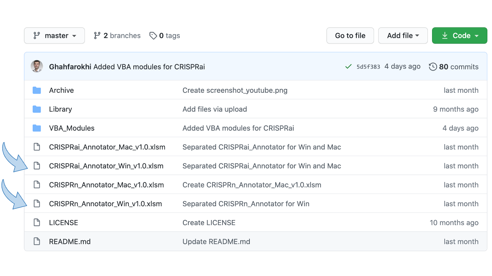</a>

A macro-enabled Excel workbook (**CRISPRn-annotator.xlsm**), which could be used to quickly select paired-sgRNAs for CRISPR-mediated gene knockout experiments. A similar Excel workbook (**CRISPRai-annotator.xlsm**) can be used for picking sgRNAs for gene activation/inhibition experiments. All sgRNAs were collected from the previously reported genome-wide sgRNA libraries. Excel files automatically download the genbank files from NCBI, and annotate the CRISPRs. 

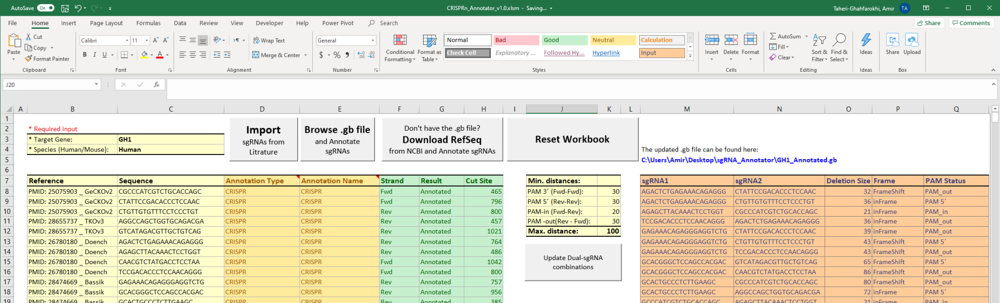

## Introduction

Paired-sgRNAs co-transfected together with wildtype Cas9 into human/mouse cells would result in achieving a higher knockout efficiencies. Simultaneous DNA cuts at the targeted gene are repaired with a high precision and thus introduce a precise deletion ([Ref. 1]). Thanks to several genome-wide pooled CRISPR screening studies, a dozen of sgRNAs have been designed against each of the human and mouse genes. Therefore, these libraries offer a straightforward way for picking sgRNA-pairs for gene knockout experiments. These libraries have been designed and went under several rounds of optimization to particularly use the sgRNAs with optimal efficacy and minimal off-target activity. These libraries cover almost all coding and non-coding genes (e.g. microRNAs and lncRNAs). I have tested several sgRNA design tools and I often (not always) ended up with the same set of sgRNAs. So, I made my life easy with making a collection of these libraries (listed here: [AddGene CRISPR Libraries]) and prepared two Excel workbooks to curate the collection for a user-specified gene. Moreover, the sgRNA_Annotator workbook can predict the deletion size for different sgRNA pairs and annotate them on a genbank file (either provided by user or automatically downloaded from NCBI RefSeq).

---

## Supported systems

* Windows

* MacOS

## Requirements

* Microsoft Excel 2016 or higher

* Internet Connection

## Installation

 * None, just enable macros using the pop up bar, which appears upon opening the workbooks.

## Tools

* **CRISPRn-Annotator.xlsm**: annotates CRISPRs used for knockout.

* **CRISPRai-Annotator.xlsm**: annotates CRISPRs used for activation and inhibition.

---

---

## Instruction

#### Youtube

Wath the detailed guideline on youtube:

<a href="http://www.youtube.com/watch?feature=player_embedded&v=MO8rAcklmbI
" target="_blank">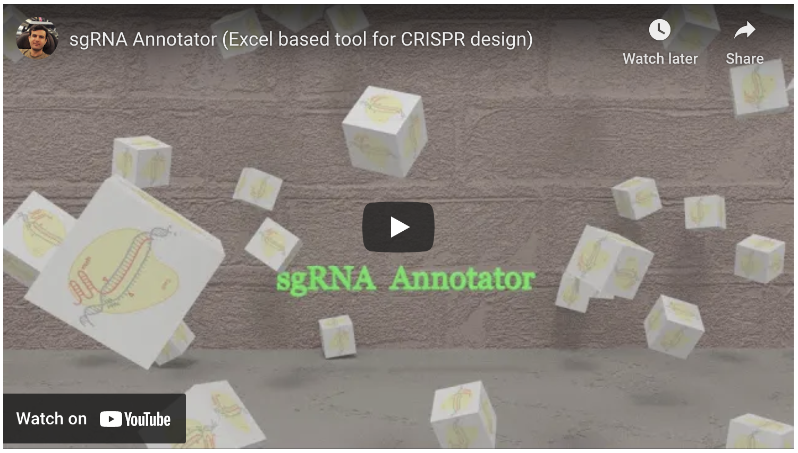</a>

#### Step-by-step guideline

1. Download the library and the “sgRNA_Annotator_v1.0.xlsm” workbook from my [GitHub repository]. 

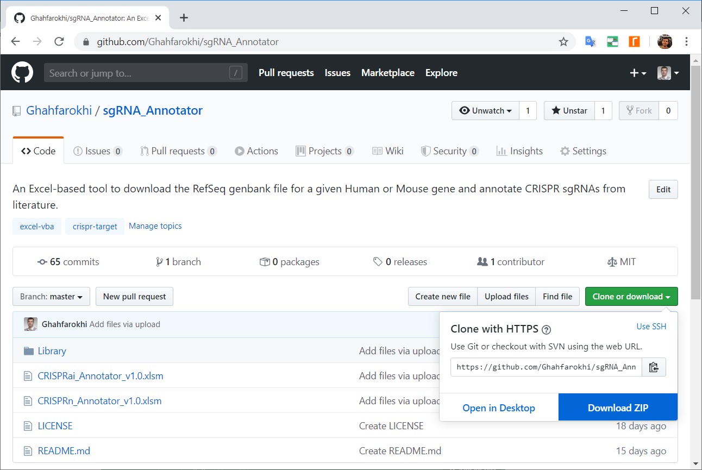

2. Unzip the downloaded files and make sure that all the .txt files exist in the "Library" folder:

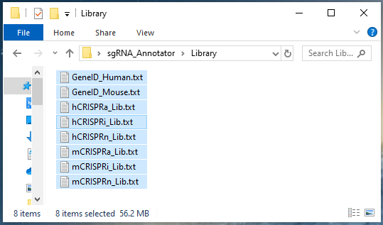

3. Open the “CRISPRn_Annotator_v1.0.xlsm” for gene knockout or “CRISPRai_Annotator_v1.0.xlsm” for gene activation/inhibition and click on the “Enable Content” button that appears on the yellow bar under the menu ribbon:

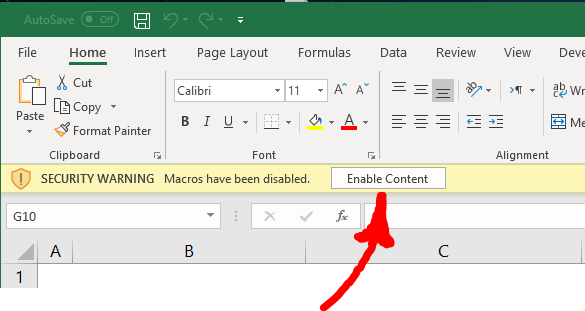

4. Provide an official gene symbol, select the species (Human or Mouse), and click on the “Import” button:

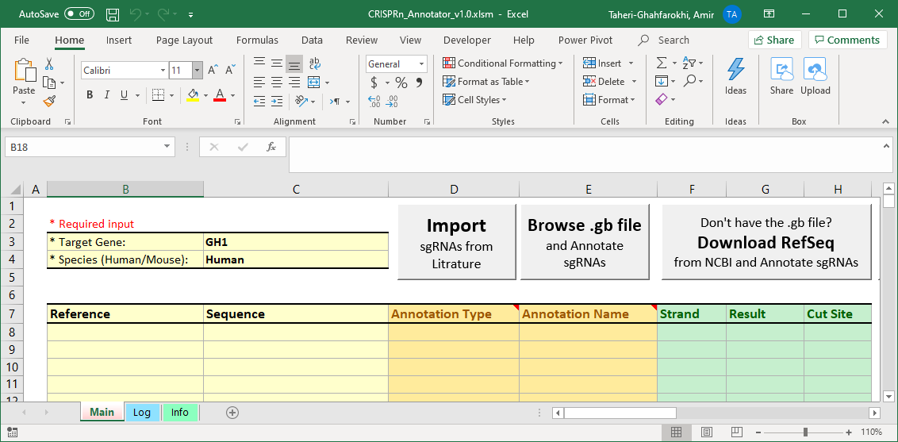

5. If you already have the genbank file for your targeted gene, click on the “Browse” button and select the file to be annotated. It is important to provide a gene sequence (and not a transcript). Alternatively, click on the “Download RefSeq” button, and wait for the Excel to download the genbank file. Annotated file can be found in the same folder that the Excel workbook is.

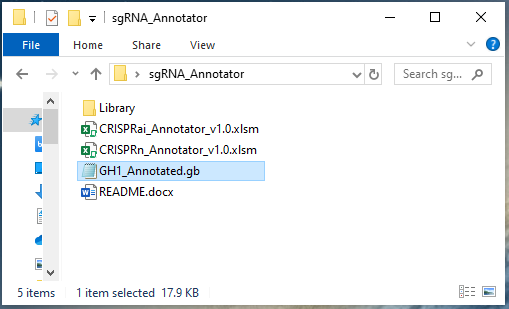

6. Check the Paired-sgRNA combination table. Note the "Frame" column, some combination of the sgRNAs may results in inframe deletions, which is not ideal for the knockout purposes.

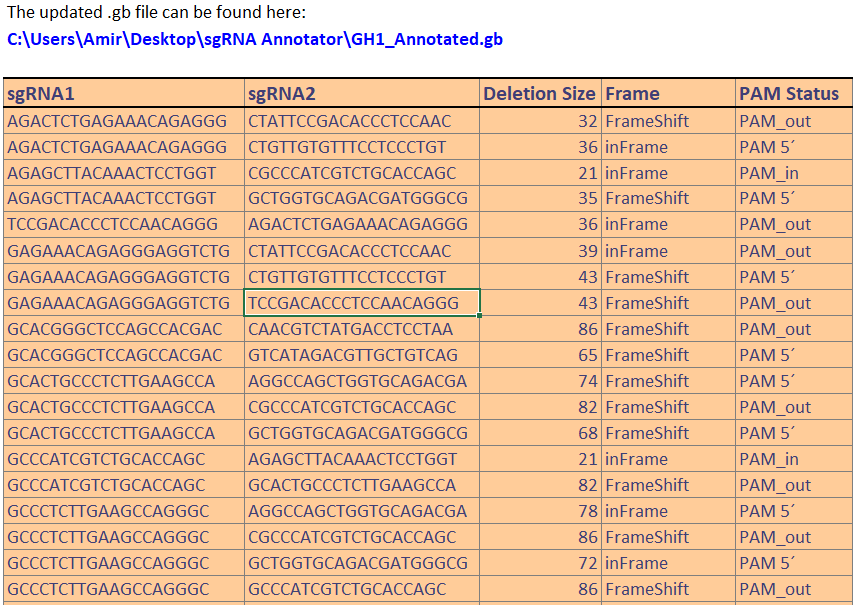

7. Adjust the distance between cut_sites if required and click on the “Update Paired-sgRNA” button for your changes to be applied.

8. Import the generated genbank file into your software of choice and enable the annotation types, the sgRNAs are annotated as “CRISPR” by default.

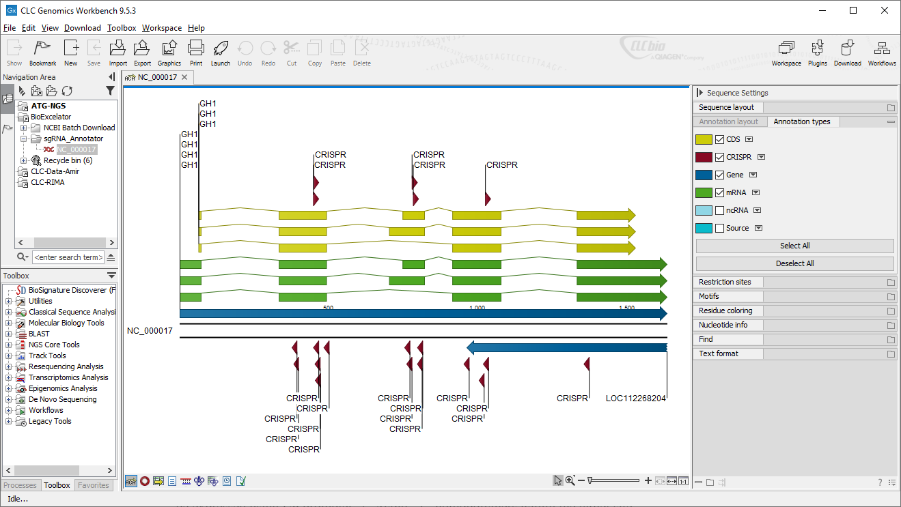

9. Selected sgRNAs can be directly converted into oligo duplexes for cloning purposes. An example of the formula for the Fwd and Rev oligos are provided below:

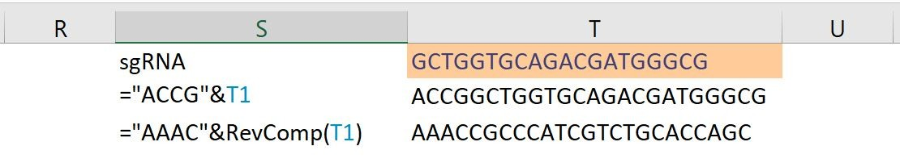

10. Finally, check the "Log" worksheet where errors are captured. Reset the workbook before closing the file.

---

#### General considerations for selecting the sgRNAs for knockout experiments
* Consider the [RNA polymerase III] and U6 promoter limitations if the sgRNA will be expressed using U6 promoter: 
 * Avoid “T” homopolymers within the target site sequence.
 * Consider an additional “G” upstream of the target site (if the High Fidelity Cas9s will be used). 
 * Some of the libraries have already taken these considerations into account, but not all.

* Ensure sgRNAs target all the transcripts. 

* Ensure sgRNAs hit the first 50% of the CDS. 

* Ideally, there is no cryptic ATG after the target sites. 

* The genetic analysis method: 
 * precise deletions after paired-sgRNA targeting would allow rapid detection of the editing efficiency on a simple agarose gel. However, deep targeted sequencing can provide a better insight into the resulting alleles. The amplicon size for deep targeting sequencing is usually short (less than 300 bp). Larger a deletion, a larger bias will be introduced in the amplification. Moreover, large deletions will require additional bioinformatics analysis of the NGS data. 
 * My recommendation is to keep the deletion shorter than 100 bp.

* Target sites with a “T” at 4th nucleotide before PAM tend to result in higher single nucleotide insertion [Ref. 2] and in principle higher percentage of frame-shifting mutations. 

---

#### How about sgRNAs for CRISPR activation/inhibition (CRISPRai)?

CRISPRai_Annotator Excel workbook can be used for CRISPRa and CRISPRi applications. There are two additional inputs that need to be specified; Modulation mode (activation/inhibition) and the promoter length:

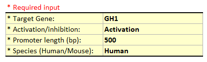

All CRISPRn/a/i sgRNAs can be annotated on the same genbank file:

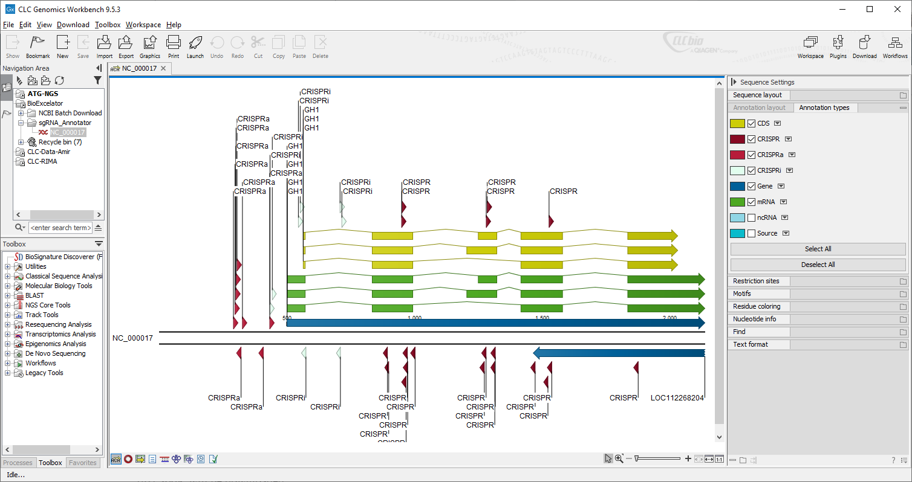

---

## Limitations of the sgRNA_Annotator: 

* The maximum size of a gene that can be downloaded is limited to 300,000 bp. 

* If the targeted gene is larger than 300kb, then only the first 300K will be downloaded. 

**Bonus**: sgRNA Annotator can be used for more general tasks like downloading the RefSeq for a gene or annotating any other sequences on genbank files (e.g., primer sequences on a plasmid map, etc).

Please report issues and bugs to Amir.Taheri.Ghahfarokhi@gmail.com

--- 

## References

[Ref. 1] - Geisinger j., et al. (2016) In vivo blunt-end cloning through CRISPR/Cas9-facilitated non-homologous end-joining. Nucleic Acids Research, 44(8): e76.

[Ref. 2] - Taheri-Ghahfarokhi A., et al. (2018) Decoding non-random mutational signatures at Cas9 targeted sites. Nucleic Acids Research, 46(16): 8417–8434.

---

## Download materials

[AddGene CRISPR Libraries]: https://www.addgene.org/crispr/libraries/
[Ref. 1]: https://academic.oup.com/nar/article/44/8/e76/2466055
[Ref. 2]: https://academic.oup.com/nar/article/46/16/8417/5055824
[GitHub repository]: https://github.com/Ghahfarokhi/sgRNA_Annotator/archive/master.zip
[RNA polymerase III]: https://en.wikipedia.org/wiki/RNA_polymerase_III#Termination